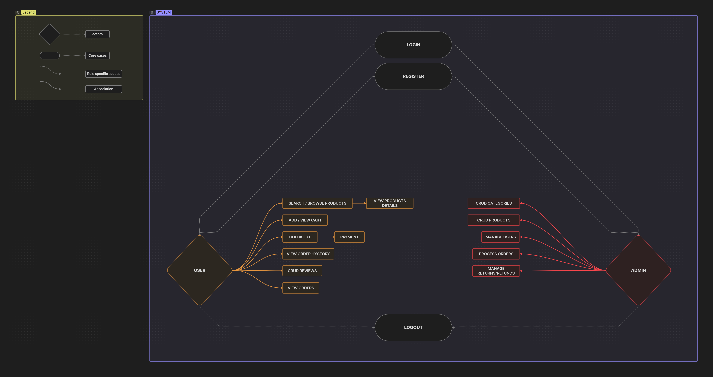
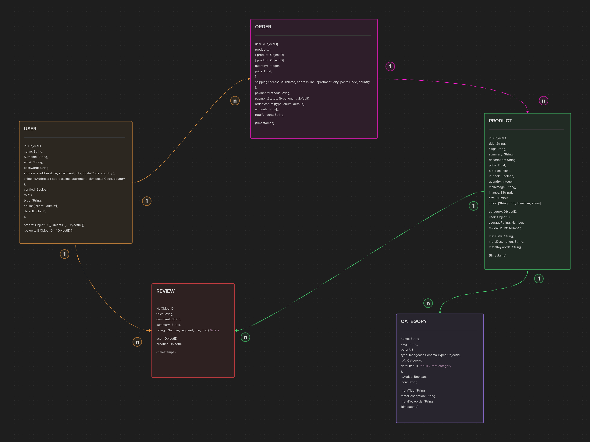
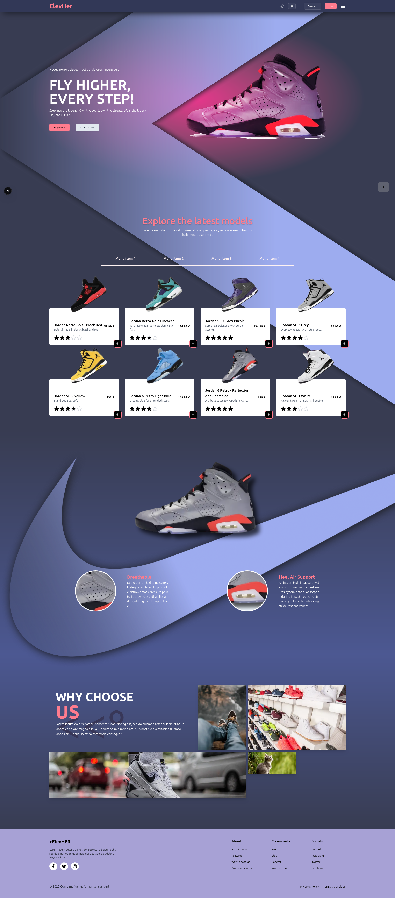
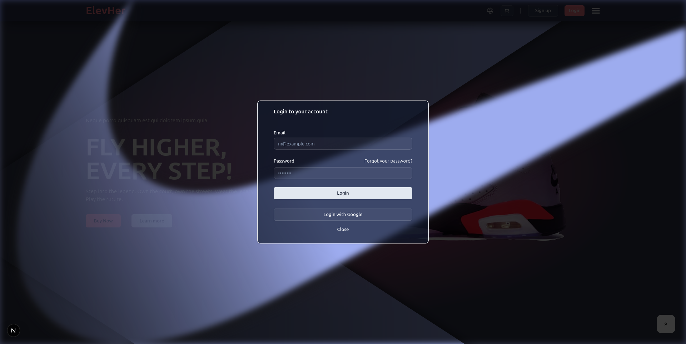
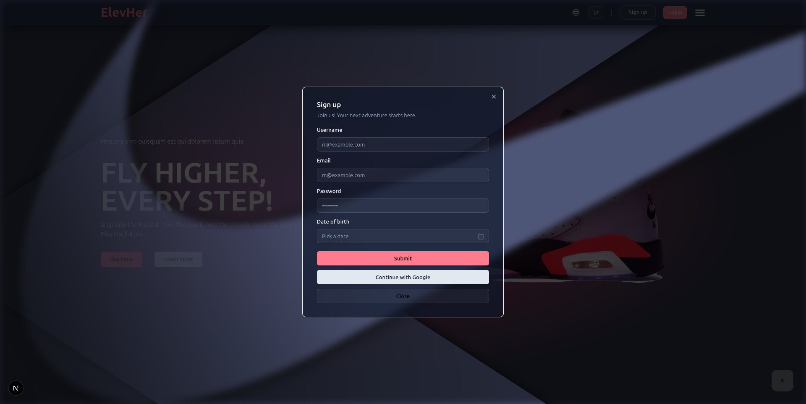
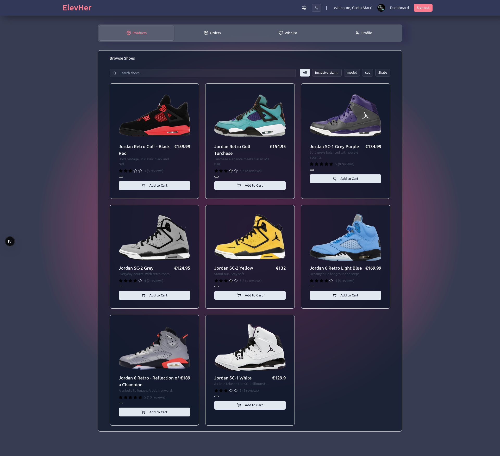
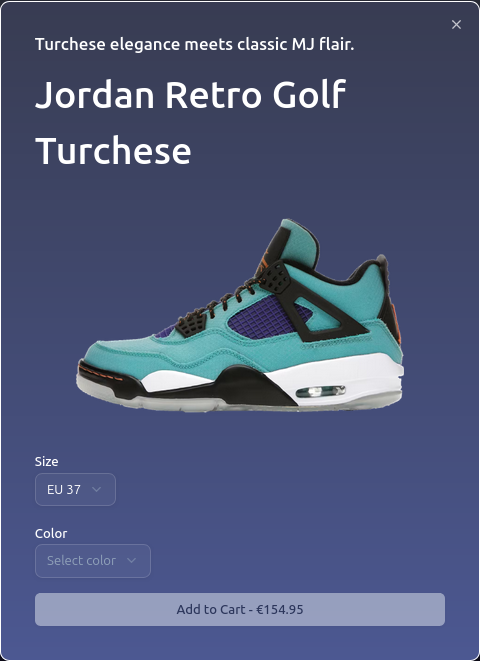
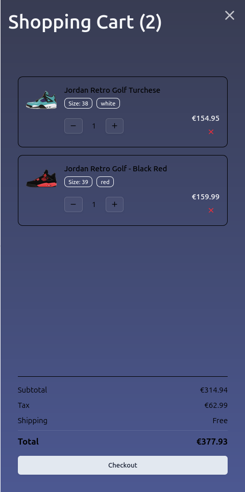

# Elev Her - E-commerce website

Elevate Her is an e-commerce concept focused on offering a user-friendly online store with curated sneakers designed specifically for women.

## About This Project

This full-stack eCommerce app was developed in just **2 weeks** for my bootcamp graduation project.  
Starting from a UI I had previously designed in Figma, I built the core architecture: a fully responsive frontend with Next.js, a custom Express backend, MongoDB database, and user authentication (including Google login).

While it’s still in 🚧 development, the foundation is solid — and the next milestones are already mapped out, including:
- [ ] Dynamic product detail pages
- [ ] Full checkout flow
- [ ] Persistent cart and wishlist
- [x] Supabase image storage
- [ ] Email verification

...and many others.

🚀 Features

    - Authentication system (Credentials and Google OAuth)
    
    - Cart functionality with quantity updates and removal
    
    - Responsive layout with dynamic navigation (desktop/mobile)
    
    - Modal system for login/signup and product dialogs
    
    - Custom design system (built with Tailwind, Shadcn, and CSS variables)
    
    - State management for cart, auth, and UI overlays
    
    - Image-optimized product displays with aspect ratio handling
    
    - Explore section with technical product highlights (materials, breathability, structure)
    
    - Client Dashboard

---

| Layer       | Tools Used                                            |
| ----------- | ----------------------------------------------------- |
| Frontend    | Next.js (App Router), Tailwind CSS                    |
| UI Library  | Shadcn/UI, Lucide Icons                               |
| Forms       | React Hook Form, Zod                                  |
| Auth        | NextAuth.js + Custom Backend Integration              |
| Backend API | Express (ESM) with modular route/controller structure |
| Database    | MongoDB                                               |
| State Mgmt  | Zustand (local store for UI/Cart/Auth)                |

---
## Use case

It describes the steps and actors involved in each situation. The use case diagram is used as a basis for further design, implementation and testing of the software.

---

## Database Design (MongoDB)

A first design draft helped me conceptually shape the database schema & relationships.

### Authentication

The authentication process is mostly handled in the backend for security reasons.  
A token is generated on login and validated with each new request.  
NextAuth.js manages the session callbacks and supports both credential-based login and third-party OAuth providers (like Google).

---

## Routing

Routing in the app is managed by Next.js using the App Router and file-based structure.  
I created both public and protected routes, for example, the dashboard is only accessible to logged-in users.  
Unauthenticated users are redirected to the homepage when trying to access restricted areas.

---

## Framework Choice

Next.js was the framework suggested by my bootcamp, and it turned out to be a great fit.  
Its features, like image optimization, server-side rendering, and file-based routing, made development smoother and helped me structure the app clearly.

---

## Key Challenge: Authentication Flow

One of the trickiest parts of this project was managing the authentication flow.

Initially, I couldn’t access user data because it was coming back `undefined` at certain points.  
After debugging, I discovered the issue was related to how **NextAuth handles callbacks and token structure**.  
I resolved it by accessing the token properly, restructuring the session callback, and making sure the API was returning a well-defined JSON object instead of raw data.

---

## Screenshots

#### Homepage

#### Login Modal

#### Signup Modal

#### menu

#### Dashboard

#### Product Modal

#### Cart

---

## Author

Made with ❤️ by [GM](gretamacri.com)